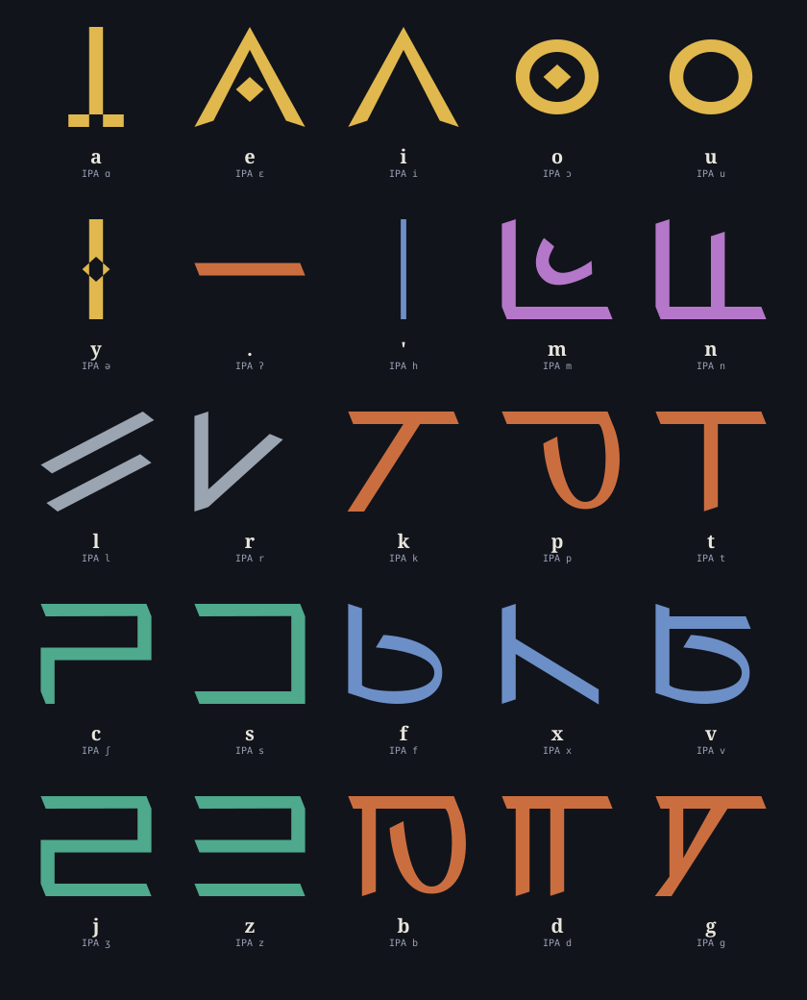
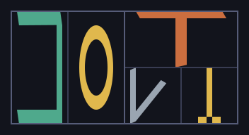
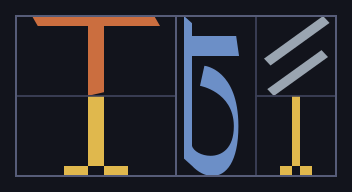
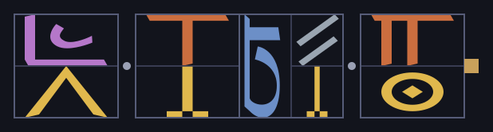

# Valbli — A Featural Block Writing System for Lojban

*valsi ("word") + bliku ("block") — "word blocks"*

Valbli is a featural writing system for [Lojban](https://lojban.org), inspired by
Hangul: individual letters combine into compact **syllable blocks** rather than
running left-to-right as a flat string, and each letter's *shape* is chosen to
encode something about the sound it represents rather than being picked
arbitrarily.

> **Status: draft.** This repository is a **derivative continuation** of an
> earlier, unfinished proposal — see [Origin & relationship to the original
> proposal](#origin--relationship-to-the-original-proposal) below before
> reading anything else. Several of the original proposal's open questions
> are resolved here (see [What this draft resolves](#what-this-draft-resolves));
> a few remain open (see [Backlog](#backlog)).

---

## Table of contents

1. [Origin & relationship to the original proposal](#origin--relationship-to-the-original-proposal)
2. [What this draft resolves](#what-this-draft-resolves)
3. [Letters](#3-letters)
4. [Syllable blocks](#4-syllable-blocks)
5. [Syllabification](#5-syllabification)
6. [Lujvo (compound words)](#6-lujvo-compound-words)
7. [Punctuation and word spacing](#7-punctuation-and-word-spacing)
8. [Handwriting and digital font](#8-handwriting-and-digital-font)
9. [Try it — the converter](#9-try-it--the-converter)
10. [Backlog](#backlog)
11. [Credits & license](#credits--license)

---

## Origin & relationship to the original proposal

Valbli was first proposed by **TUSF** in a 2018 gist,
[*"A draft for a block writing system, designed for Lojban"*](https://gist.github.com/TUSF/d85c3d241c90fede0ea7065ed1107fd5)
(also mirrored at `tusf.page/valbli`). That original write-up introduced the
core idea — a Hangul-style, featural block script for Lojban — along with the
initial 25-letter inventory, the four consonant base-shape families (stops,
sibilants, fricatives, nasals), and the first hand-drawn block layouts,
including the `Sefta.sfdir` FontForge source this repository still uses for
its consonant letterforms.

Critically, the original author was explicit that the proposal was
unfinished, and left several concrete design questions open rather than
resolved — for example:

- the vowel glyphs were picked mainly for visual distinctiveness, without a
  shared underlying logic the way the consonant families had;
- `l` and `r` were acknowledged not to fit any of the four consonant
  templates, and were left as unexplained exceptions;
- for gismu of shape CVCCV, the author noted the medial consonant pair could
  reasonably be split two different ways, and left the choice to individual
  preference rather than adopting a rule — the original document's own
  worked example for `sutra` even says the `sut,ra` split was used simply
  because it "made sense" to the author, not because of any stated rule;
- how more than two rafsi should stack when several are chained into a
  lujvo was flagged as undefined and "may require experimenting";
- when asked in the gist's comments how the comma should be written, the
  author replied that this had never been established;
- quotation marking was not addressed at all;
- writing direction (left-to-right vs. top-to-bottom) was left as an open
  choice with no resolution.

**This repository is a draft aimed specifically at closing those gaps** —
not at replacing the original concept, but at taking the parts of it that
were already solid (the letter inventory, the four consonant base shapes,
the general Hangul-block approach, the original font source) and adding the
missing rules needed to actually use the system consistently: a resolved
vowel design, a geometric (rather than hand-picked) rule for block layout
that also covers `l`/`r`, an adopted syllabification standard, a lujvo/rafsi
stacking rule, a punctuation system, and a working interactive converter.
Anything not explicitly listed as new below should be assumed to come from
the original proposal.

---

## What this draft resolves

| # | Open question in the original proposal | Resolution adopted here |
|---|---|---|
| 1 | Vowel letterforms chosen individually, for distinctiveness only — no shared logic across `a e i o u y` | Two-feature featural redesign: backness/rounding → base shape (chevron / stem / circle), height → modifier (plain / +dot / +base-bar). See [§3](#3-letters). |
| 2 | `l` and `r` don't fit any of the four consonant templates and were left unexplained | Orientation is derived from each letter's *own* glyph geometry (wider-than-tall → horizontal, taller-than-wide → vertical) instead of a memorized class list — this also resolves `l`/`r` without a special case. See [§4](#4-syllable-blocks). |
| 3 | CVCCV gismu can split `CV,CCV` or `CVC,CV`; original left it to "individual idiolect" | Adopted Lojban's own official rule, CLL §3.9: a medial consonant pair splits between syllables *unless* it is one of the 48 permissible word-initial pairs, in which case it moves as a unit to the following syllable. See [§5](#5-syllabification). |
| 4 | Stacking of 3+ rafsi in a lujvo left undefined, "may require experimenting" | Nesting depth is capped at exactly two levels always (letters-in-block, blocks-in-word); a lujvo of any length is simply a longer flat row of syllable blocks, because Lojban morphology is self-segregating. See [§6](#6-lujvo-compound-words). |
| 5 | Comma/pause marking: author stated in the gist comments that this was never established | Three explicit glyphs defined, by increasing weight: word-boundary dot, pause-suppression tick, utterance-end square. See [§7](#7-punctuation-and-word-spacing). |
| 6 | Quotation (`lu ... li'u`) not addressed | Resolved as a non-issue: quote markers are ordinary cmavo, already written as ordinary syllable blocks. See [§7](#7-punctuation-and-word-spacing). |
| 7 | Writing direction (LTR vs. top-to-bottom) undecided | **Still open** — not resolved by this draft. The converter renders left-to-right purely as a practical demo choice. See [Backlog](#backlog). |

A note on internal consistency: because rule **3** above was adopted after
the original `sutra`/`sut,ra` example was already circulating, that specific
split is informal, not CLL-derived — under the official CLL §3.9 rule
actually implemented in the converter, `sutra` syllabifies as `su,tra`
(because `tr` is one of the 48 permissible initial pairs), and similarly
`tavla` syllabifies as `ta,vla` (because `vl` is also permissible). Any
worked example in this document that shows a different split for those two
words is describing the *original, informal* version of the system, not the
CLL-based rule this draft actually implements.

---

## 3. Letters

Lojban (in its Roman-alphabet, "Roman-mode" orthography) uses 6 vowels and 19
functioning consonant-class letters — 25 letters in total. (Lojban's full
phonemic inventory is technically 27 sounds, but the labio-velar and palatal
approximants **w**/**j**-glide are written as the first half of a diphthong
rather than as their own letters, which is why the practical alphabet is 25,
not 27.)

| Latin | IPA | Family | Latin | IPA | Family |
|---|---|---|---|---|---|
| a | ɑ | vowel | s | s | sibilant |
| e | ɛ | vowel | f | f (ɸ) | fricative |
| i | i | vowel | x | x | fricative |
| o | ɔ | vowel | v | v (β) | fricative |
| u | u | vowel | j | ʒ (ʐ) | sibilant |
| y | ə | vowel | z | z | sibilant |
| . | ʔ | (glottal stop) | b | b | stop |
| ' | h | (glottal spirant) | d | d | stop |
| m | m | nasal | g | g | stop |
| n | n | nasal | k | k | stop |
| l | l | (own class) | p | p | stop |
| r | r | (own class) | t | t | stop |
| c | ʃ (ʂ) | sibilant | | | |

Consonant letterforms are **featural** and, along with the four base-shape
families below, come directly from the original proposal: every letter's
shape is built from a base template shared by its manner-of-articulation
class, plus a letter-specific modification.

| Family | Members | Base shape |
|---|---|---|
| Stops | `.` b d g k p t | horizontal line |
| Sibilants | c j s z | left-facing cup |
| Fricatives | `'` f v x | vertical line |
| Nasals | m n | right-facing right angle |
| — | l, r | no shared base in the original proposal — see [§4](#4-syllable-blocks) for how this draft derives their layout behaviour from their own glyph geometry instead |

**The vowels are new in this draft.** The original six vowel glyphs were
chosen individually, with only a partial pattern and no shared
two-dimensional logic — `i`, `u`, and `a` didn't relate visually to any other
letter the way the consonants did. This draft instead applies two
independent visual features, mirroring how the consonants already work
(base shape = family, modification = specific sound):

- **Backness/rounding → base shape** (3 families): front unrounded → chevron
  (Λ); central unrounded → vertical stem; back rounded → circle.
- **Height → modifier**: high → base shape alone; mid → base shape + inner
  dot; low (only `a`) → base shape "opened" — a stem with a horizontal base
  bar instead of a dot.

| Letter | Family | Height | Shape |
|---|---|---|---|
| i | front | high | plain chevron |
| e | front | mid | chevron + dot |
| y | central | mid | stem + dot |
| a | central | low | stem + base bar |
| u | back-rounded | high | plain circle |
| o | back-rounded | mid | circle + dot |

`e` is unchanged from the original design (it already followed this logic).
`i`, `a`, `y`, `u`, `o` were reshaped so every vowel now belongs to a
coherent family, the same way every consonant already did.

---

## 4. Syllable blocks

**Problem in the original proposal:** hand-picking a template per consonant
class (stops/nasals stretch horizontally, fricatives/sibilants stretch
vertically) leaves outliers undefined — `l` and `r` "don't fall into either
category" and have no template at all.

**Rule adopted — recursive split by each letter's own base-shape geometry:**
for each letter in a syllable, in reading order, applied to whatever
rectangle of the block currently remains:

 

- If the letter's own base glyph is **wider than tall** → it claims a **top
  strip**, pushing the rest of the block down.
- If the letter's own base glyph is **taller than wide** → it claims a
  **left strip**, pushing the rest of the block right.
- A **vowel that is not the final letter** in the block has no orientation
  of its own, so it **alternates the axis** used by the previous split.
- The **final letter** in the block always fills whatever rectangle remains,
  in full.

This one rule — evaluated from each letter's actual glyph geometry, not a
memorised list of consonant classes — is also what resolves `l` and `r`:
measuring the two glyphs directly, `l` (two parallel diagonal strokes) is
wider than tall (→ horizontal, joins the stops/nasals behaviour), and `r`
(a V-like stroke) is taller than wide (→ vertical, joins the
fricatives/sibilants behaviour). Neither needs a hand-picked special case.

**Worked example — `sutra`** (CLL-correct split: `su,tra`): in **su**, `s`
(sibilant → vertical) claims a left strip and `u` (last letter of this
syllable) fills the remainder. In **tra**, `t` (stop → horizontal) claims a
top strip; `r` (vertical, per its own glyph shape) claims a left strip of
what remains; `a` (last letter) fills whatever is left. *(The original
proposal's own worked example for this word used the informal `sut,ra`
split instead — see the note at the end of [§2](#what-this-draft-resolves).)*

Letters **stretch to fill** whatever strip they claim — this is deliberate,
not a rendering artifact: it's what makes the blocks compress the way
Hangul's do.

*Open question:* whether a claimed strip's width/height should be
proportional to that letter's own glyph proportions, or fixed at 50/50
regardless of shape — currently 50/50 for simplicity; a font-drawing pass
may revisit this.

---

## 5. Syllabification

`gismu` (Lojban's core root words) of shape CVCCV (e.g. `patfu`) are
ambiguous: the medial consonant pair can be read as coda+onset (`CVC,CV`) or
as an onset cluster (`CV,CCV`). The original proposal left this to
"individual idiolect."

**Resolution adopted here:** Lojban's own official rule, from *The Complete
Lojban Language* (CLL), §3.9 "Syllabication and Stress": a consonant pair is
normally divided between the two syllables it separates, *unless* that pair
is itself one of the 48 permissible word-initial consonant pairs, in which
case it's assigned in full to the following syllable. The same section
extends this to three-consonant clusters: the boundary falls between the
first and second consonant.

- Medial pair **is** a valid word-initial pair (e.g. `tr`, `vl`, `sk`) →
  boundary before the pair → `CV,CCV` (e.g. `su,tra`, `ta,vla`)
- Medial pair **is not** a valid word-initial pair (e.g. `tf`, `kt`) →
  boundary splits the pair → `CVC,CV` (e.g. `pat,fu`, `cuk,ta`)

This reuses the same "valid initial pair" table Valbli needs anyway to
decide which consonant clusters get their own block shapes, and generalises
directly to the three-consonant clusters that appear when rafsi are joined
into lujvo.

*(Source: Cowan, J.W., The Complete Lojban Language, §3.9,
<https://lojban.github.io/cll/3/9/>)*

---

## 6. Lujvo (compound words)

**Problem in the original proposal:** how more than two rafsi (compound-word
roots) should stack when joined into a lujvo was left undefined, flagged as
possibly needing "experimenting." A naive design risks nesting blocks inside
blocks inside blocks, one level per rafsi — increasingly unreadable as words
get longer.

**Resolution adopted here:** no new nesting rule is actually needed, given
one design decision: **nesting depth is capped at exactly two levels,
always** (letters inside a syllable block, syllable blocks inside a word).
Regardless of how many rafsi a lujvo contains, it's written as a single flat,
linear row of syllable blocks — never blocks containing blocks containing
blocks. Longer lujvo simply produce a longer row, not a deeper structure.

This works because Lojban morphology is self-segregating: the §5
syllabication rule re-derives syllable boundaries directly from the raw
letter stream, with no need to know in advance where the original rafsi
boundaries were. A "rafsi block" isn't a distinct visual unit from an
ordinary syllable block — a lujvo is simply *more syllables* than a plain
gismu, written with the exact same mechanism.

**Worked example:** `sampli` ("computer user") is built from the rafsi `sam`
(from `skami`, computer) and `pli` (from `pilno`, uses). Visually it's just
two syllable blocks, `sam,pli` — no special rafsi-boundary marker needed.
Hyphen letters (y, r, n, inserted between rafsi to avoid a forbidden
cluster) need no new symbol either — they're ordinary letters and
participate in the same syllabication rule as everything else.

**Deliberate choice: no visual marker at rafsi boundaries by default.**
Since self-segregation already guarantees a lujvo can always be parsed back
into its rafsi from the letters alone, a boundary marker would be a purely
decorative option for pedagogical texts, not a structural requirement — left
off by default, in line with minimising complexity.

---

## 7. Punctuation and word spacing

The original proposal did not settle on how the comma (or word/utterance
boundaries generally) should be written — its author stated as much directly
when asked. This draft defines an explicit system.

Word and utterance boundaries are marked with small, explicit glyphs, rather
than relying on blank-space width alone — pure whitespace is unreliable in
handwriting and would tie the design to whichever writing direction is
eventually chosen (still undecided, see [Backlog](#backlog)); an explicit
mark works identically whether text runs left-to-right or top-to-bottom.

Three marks, in increasing visual weight:

1. **Word boundary** — a small dot at mid-height between the last block of
   one word and the first block of the next. Fixed size, independent of
   block size.
2. **Pause-suppression comma** — Lojban's actual (rare) comma use, marking
   an unexpected presence or absence of a pause. A short tick attached
   directly to the letter/block it modifies, not placed between words.
3. **Utterance/sentence end** (the written equivalent of the `faho` pause)
   — a filled square, visually heavier than the word-dot, after the last
   block of the utterance.

**Quotation resolved as a side effect:** Lojban's `lu ... li'u` quote
markers are ordinary cmavo (grammar words) — a point the original proposal
never addressed — so they're already written as ordinary syllable blocks;
no separate quotation glyph is needed.

Because the word boundary is now an explicit glyph, the physical gap between
words stays the same fixed width already used between syllable blocks
within a word.

**Worked example:** `mi tavla do` ("I speak to you.") →
`[mi]·[ta][vla]·[do]▪`

---

## 8. Handwriting and digital font

The recursive split rule ([§4](#4-syllable-blocks)) gives every block a
different internal layout depending on which letters it contains and how
many — which means ordinary diacritic-stacking font technology (gluing
pre-made accent marks onto a base letter) can't represent Valbli. Each
block's internal geometry has to be computed, not assembled from fixed
parts.

- **Fixed outer envelope:** every syllable block occupies the same
  fixed-ratio footprint regardless of letter count, the same way every
  Hangul block does — this is also what makes the fixed-width interword
  dot/gap from §7 work consistently across a whole text.
- **Stroke order = the layout recursion itself:** draw the first letter's
  strip first, then recurse into the remainder in reading order, ending
  with the final letter that fills whatever is left.
- **Two ductus variants:** *print/digital* uses straight strokes, sharp
  corners, and visible divider lines between strips; *handwriting* uses the
  same recursive strip structure, but divider lines are never drawn — the
  boundary between letters is inferred from where one letter's ink stops
  and the next begins, the way handwritten Hangul doesn't draw a grid.
- **Digital font build:** because block internals vary with letter count
  and identity, the font needs OpenType ligature substitution (GSUB) — one
  precomposed glyph per attested letter sequence, generated programmatically
  from the §4 rule — not accent/diacritic stacking. This mirrors how
  existing Hangul fonts are built. The `Sefta.sfdir` FontForge source in
  this repo (inherited from the original proposal) implements the base
  (un-composed) letterforms; the composed syllable-block glyphs are
  generated by the converter tool below rather than pre-baked into the
  font.

---

## 9. Try it — the converter

[`converter.html`](converter.html) is a self-contained, offline-capable web
tool: type Lojban text in Latin script and it renders live Valbli block
writing, using:

- the **real letterform paths**, extracted directly from `Sefta.sfdir`, for
  all 19 consonant-class letters (inherited from the original proposal);
- the **redesigned featural vowels** from [§3](#3-letters) (new in this
  draft);
- **automatic syllabification** per the CLL §3.9 rule (new in this draft —
  see [§5](#5-syllabification));
- the **recursive block-layout algorithm** (new in this draft — see
  [§4](#4-syllable-blocks));
- the **punctuation marks** from [§7](#7-punctuation-and-word-spacing) (new
  in this draft).

Just open the file in any browser — no build step, no server, no
dependencies.

*Known limitation:* diphthongs (e.g. `oi` in `coi`) aren't merged into a
single syllable nucleus yet — see [Backlog](#backlog). The tool currently
splits them into two syllables.

---

## Backlog

Identified, not yet addressed:

- Diphthongs (ai, ei, oi, au, etc.) and CVVV syllable structure.
- A way to mark proper names (**cmene**) and loan-words (**fu'ivla**), since
  Valbli has no upper/lower-case distinction. *(Open in the original
  proposal too.)*
- Stress marking for irregular stress on gismu/fu'ivla.
- Digits and the decimal point.
- Whether rare/unattested syllable shapes (needed for foreign fu'ivla) get a
  generic on-the-fly compositing fallback in the font, or are simply
  excluded until needed.
- Final placement/shape rules for the apostrophe (`'`) between vowels, and a
  single fixed symbol/position for the glottal stop (`.`) above/below a
  word block.
- **Writing direction: top-to-bottom vs. left-to-right — still undecided,
  exactly as in the original proposal.** (The converter renders
  left-to-right purely as a practical demo choice.)
- No full, naturally-occurring Lojban sentence of real length has been
  tested against the system yet.

---

## Credits & license

- **Original concept, letter inventory, the four consonant base-shape
  families, and the `Sefta.sfdir` font implementation:** TUSF, in the
  original proposal
  [*"A draft for a block writing system, designed for Lojban"*](https://gist.github.com/TUSF/d85c3d241c90fede0ea7065ed1107fd5)
  (2018, `tusf.page/valbli`). Please refer to that gist for the original,
  unmodified proposal and its revision history.
- **This repository** (vowel redesign, syllable-block recursion rule,
  syllabification rule, lujvo-chaining rule, punctuation system,
  handwriting/font guidance, and the interactive converter) is a derivative
  draft built on top of that proposal, aimed at resolving the open
  questions the original author explicitly left unsettled (see
  [What this draft resolves](#what-this-draft-resolves)).
- Lojban itself: the Logical Language Group (LLG).

This project is a fan-made derivative work and is not affiliated with or
endorsed by TUSF. If you are TUSF and would like this relationship
described differently, credited differently, or taken down, please open an
issue.

See [`LICENSE`](LICENSE) for licensing terms.
